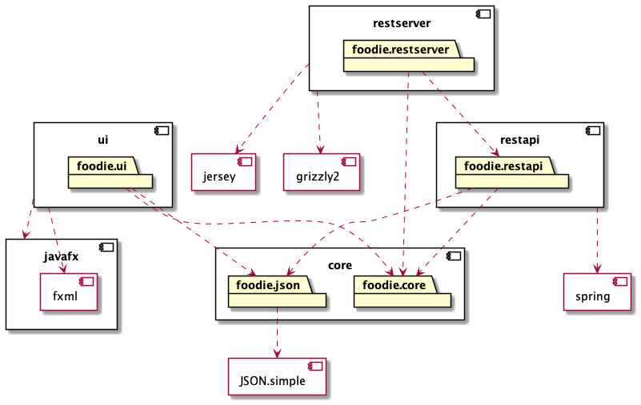

# Foodie

Dette prosjektet er konfigurert som et multi-modul-prosjekt med maven. 
- Domene- og persistenslaget ligger i modulen `core`
- Brukergrensesnittet ligger i modulen `ui`
- Restserver og restapi ligger i modulen `rest`
- Prosjektet inneholder tester for alle moduelene, med rimelig god dekningsgrad.

## Arkitekturdiagram

## Brukerhistorier

### Legge til en oppskrift (us-1)

Som bruker ønsker jeg å legge til en ny oppskrift i min kokebok, og angi denne med en merkelapp slik at den kan vises med lignende oppskrifter.  

Brukeren har behov for å opprette en ny oppskrift. Oppskriften må inneholde navn, en beskrivende framgangsmåte, antall porsjoner og en liste av tilhørende ingredienser. Ingrediensene må kunne angis med navn, mengde og enhet. Brukeren har behov for å legge til en passende merkelapp på oppskriften som det kan filtreres på i kokeboken. 

#### Viktig å kunne se
- En ny oppskrift opprettes med angitt navn, framgangsmåte og antall porsjoner 
- En ingrediens opprettes med angitt navn, mengde og enhet
- Ingredienser blir lagt til i oppskriften
- Oppskriften får angitt merkelapp
- Oppskriften kan filtreres på denne merkelappen
- Oppskriften blir lagt til i kokeboken

#### Viktig å kunne gjøre
- Lage en ny oppskrift med navn, framgangsmåte og antall porsjoner
- Lage en ny ingrediens med navn, mengde og enhet
- Legge til ingredienser i oppskriften
- Angi en merkelapp på oppskriften
- Filtrere oppskrifter i kokeboken basert på denne merkelappen
- Legge til oppskriften i kokeboken

### Redigere oppskrift (us-2)

Som bruker ønsker jeg å redigere en oppskrift ved å legge til én ingrediens og endre antall porsjoner. 

Brukeren har behov for å legge til én ingrediens i en oppskrift med angitt navn, mengde og enhet. Brukeren har behov for å endre antall porsjoner på en oppskrift, slik at mengden av hver ingrediens endres i henhold til dette. 

#### Viktig å kunne se

- Ingrediensen legges til i oppskriften
- Mengden av hver ingrediens endres i henhold til antall porsjoner

#### Viktig å kunne gjøre

- Legge til en ingrediens
- Redigere antall porsjoner på en oppskrift 

## Illustrerende skjermbilder av appen

