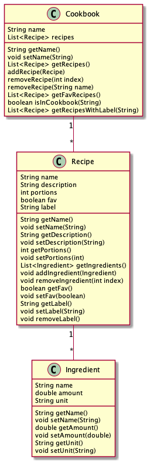

# Kildekode for kjernelogikken

Kjernelogikken utgjøres av tre klasser:

- `Cookbook` - en kokebok er representert med navn. Hver kokebok består av en samling med oppskrifter, og metoder for å legge til og fjerne disse.
- `Recipe` - en oppskrift er representert med navn, beskrivelse og antall porsjoner. Hver oppskrift har en liste med ingredienser, og metoder for å legge til og fjerne disse.
- `Ingredient` - en ingrediens er representert med navn, mengde og enhet.

## Klassediagram

