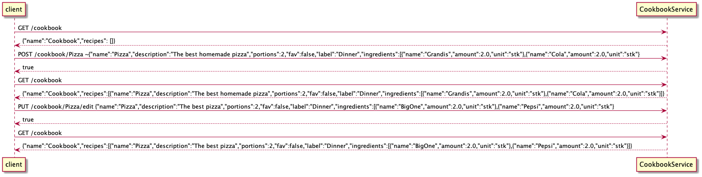

# Modul for REST-API og REST-server

Denne modulen inneholder restserveren og REST-APIet til applikasjonen. Vi har valgt å bruke **spring-boot** for å implementere REST-APIet vårt.
Spring-boot er et populært rammeverk for web-applikasjoner som gjør setup og konfigurasjon av restserveren og REST-APIet enklere.

# Oppsett av restserveren
- `CookbookApplication` - Starter restserveren ved å kalle på SpringApplication.run
- `CookbookController` - Håndterer innkommende RESTAPI-forespørsler (GET, POST, PUT og DELETE)
- `CookbookService` - Håndterer business logikken (informasjonsutvekslingen mellom restserveren og appen) 

Vårt base endpoint er "/cookbook" og metodene i CookbookController er:

- **GET**: For å hente ut hele kokeboken ("/cookbook")
- **POST**: Legger til en oppskrift i kokeboken("/cookbook/{name}")
- **PUT**: Redigerer en oppskrift i kokeboken("/cookbook/{name}/edit")
- **DELETE**: Sletter en oppskrift i kokeboken("/cookbook/{name}")

# Hvordan starte restserveren
For å starte restserveren, skriv følgende kommandoer i terminalen: 
- `cd foodie`
- `mvn install` 
- `cd rest`
- `mvn spring-boot:run` 
- Da er serveren skrudd på
- `ctrl + C`for å terminere serveren

# Testing

Vi har tre tester for å teste funkjsonaliteten i REST-API klassene:

- `CookbookControllerTest` - enhetstest for CookbookController-klassen. 
- `CookbookServiceTest` - enhetstest for CookbookService-klassen
- `IntegrationTest` - integrasjonstest for å teste at sammenkoblingen mellom CookbookController og CookbokService

I `CookbookControllerTest` brukes **Spring Boots MockMvc** som lager en Mockserver slik at vi kan teste serveren uten å bruke den. WebMvcTest-annotasjonen starter opp Spring application context og sender HTTP-forespørsler til mockserveren slik at vi kan teste at HTTP-forspørslene i `CookbookController` fungerer. Vi bruker **MockBean** for å lage en mocket `CookbookService` slik at den ekte serveren ikke blir endret, i tillegg til at testen ikke er avhengig av CookbookService for å fungere (enhetstest). Grunnen til at vi velger å bruke MockMvc er fordi vi ikke vil at dataen på servern skal endres på hver gang man kjører testene.

I `IntegrationTest` brukes **SpringBootTest** med WebEnviroment.RANDOM_PORT som starter opp application context og setter en server-port. Vi bruker **TestRestRemplate** med SpringBootTesten for å sende http-requester til serveren. Vi tester kun getCookbook fordi vi tester på den ekte serveren og vil ikke endre noe på den under testing. Integrasjonstesten tester at de tre rest-klassene fungerer sammen.

