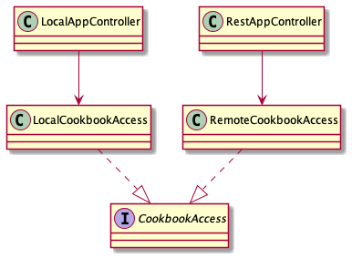
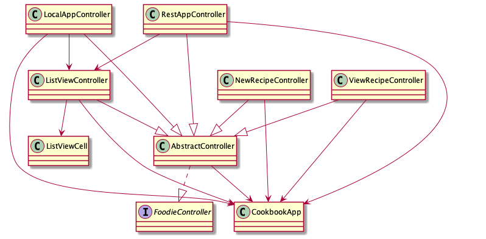
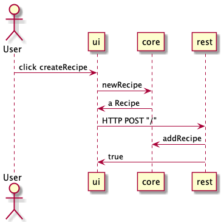

# Kildekode for brukergrensesnittet

Vi har brukt JavaFX og FXML for å utarbeide brukergrensesnittet.
Brukergrensesnittet består av en kokebok i form av et **Cookbook**-objekt med en liste av oppskrifter i form av **Recipe**-objekt. Brukeren kan klikke på objektene i listen for å komme til en ny side som viser frem innholdet i oppskriftene. Hver oppskrift inneholder en liste av ingredienser representert ved **Ingredient**-objekt. Bukeren har mulighet til å legge til og fjerne oppskrifter samt redigere disse.

## Arkitektur

Vi har to varianter av applikasjonen. Den ene bruker lokale data lagret på fil, mens den andre benytter data håndtert gjennom REST-APIet på en server. Derfor har vi to kontroller-klasser `LocalAppController` og `RestAppController`, disse er subklasser av `AbstractController` for å gjøre det lettere å dele kode mellom de ulike kontrollerene. Datatilgangen er spesifisert i klassene `RemoteCookbookAccess` og `LocalCookbookAccess`, og disse implementerer grensesnittet **CookbookAccess**. 

Applikasjonen har èn Appklasse, `CookbookApp`. Det er kontrolleren spesifisert i fxml-filen `Main.fxml` som avgjør om applikasjonen kjører på lokalt eller med REST-APIet. Applikasjonen kjører i utgangspunktet på REST, men det er mulig å kjøre applikasjonen lokalt ved å endre kontrolleren i `Main.fxml` til `LocalAppController`. 

For å håndtere sceneskifte inneholder applikasjonen flere hjelpeklasser, deriblant `SceneHandler`, som håndterer de ulike scenene. De er lagret i FxmlModel-objekter med all informasjonen til de ulike scenene. når en scene skal byttes til bil Fxmlhandler enten laste inn scenen fra fxml-filen eller returnere scenen om den har blitt lastet tidligere. 

Samspillet med kontrollerne til applikasjonen er illustrert på klassediagrammet under. 

Følgende sekvensdiagram viser samspillet mellom kjernemodulen, brukergrensesnittmodulen, REST-tjenesten når en bruker oppretter en ny oppskrift og legger denne til i kokeboken.

