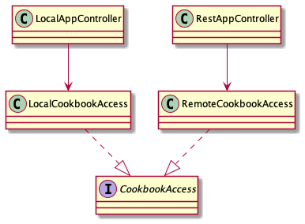

# Kildekode for brukergrensesnittet

Vi har brukt JavaFX og FXML for å utarbeide brukergrensesnittet.

## Arkitektur

Vi har to varianter av applikasjonen. Den ene bruker lokale data lagret på fil, mens den andre benytter data håndtert gjennom REST-APIet på en server. Derfor har vi to kontroller-klasser **LocalAppController** og **RestAppController**. Datatilgangen er spesifisert i klassene **RemoteCookbookAccess** og **LocalCookbookAccess**, og disse implementerer grensesnittet **CookbookAccess**. 

Samspillet med kontrollerne til applikasjonen er illustrert på klassediagrammet under. 

Følgende diagram viser samspillet mellom kontrollerne, datatilgangsobjektet, REST-tjenesten og diverse hjelpeobjekter ?? når man skal redigere en oppskrift i brukergrensesnittet ?

