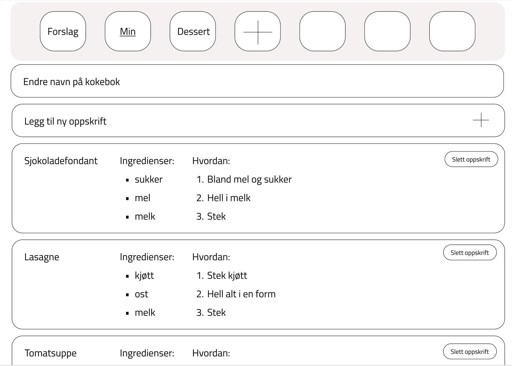
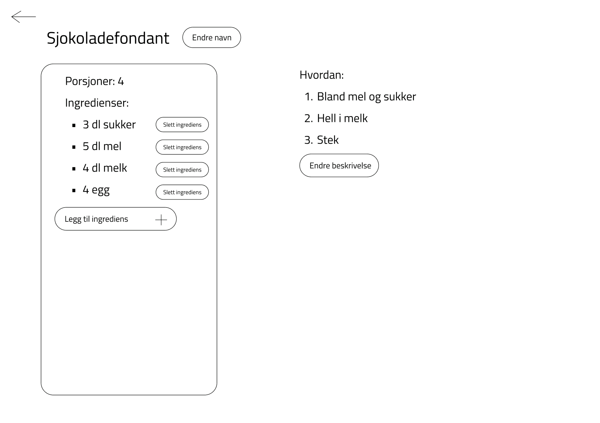

# Brukerhistorier

## Legge til en oppskrift (us-1)

Som bruker ønsker jeg å kunne legge til mine egne oppskrifter i en kokebok.

Brukeren har behov for å opprette en ny kokebok, og legge til en ny oppskrift i denne. Videre må brukeren kunne legge til ingredienser i denne oppskriften med angitt mengde og enhet. 

### Viktig å kunne se
- Kokeboken opprettes
- Oppskriften blir lagt til i kokeboken
- Ingredienser blir lagt til i oppskriften

### Viktig å kunne gjøre
- Opprette ny kokebok
- Legge til en ny oppskrift 
- Legge til ingredienser i en oppskrift

## Endre antall porsjoner (us-2)

Som bruker ønsker jeg å endre antall porsjoner på en oppskrift. 

Brukeren har behov for å endre antall porsjoner på en oppskrift, slik at mengden av hver ingrediens endres i henhold til dette. 

### Viktig å kunne se

- At mengden av hver ingrediens endres i henhold til antall porsjoner

### Viktig å kunne gjøre

- Redigere antall porsjoner på en oppskrift 

### Illustrende skjermbilde av appen

